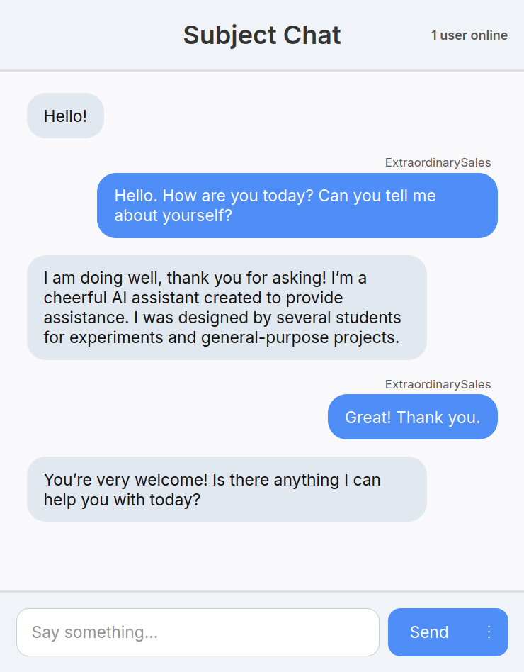

# Simple Chatbot

A simple web-based chatbot implemented in Python.  
Model: [Gemma 3 1B](https://ai.google.dev/gemma/docs/core) with [Ollama](https://ollama.com/).  
Backend: [Flask](https://flask.palletsprojects.com/en/stable/).  
WordLists: [top-english-wordlists](https://github.com/david47k/top-english-wordlists/tree/master) by david47k.  

## Requirements
 - Python 3.8 or higher
   - Flask
   - Ollama
   - Requests
 - Ollama
 - Gemma 3 1B model
 - At least 8GB of RAM

## Installation and Usage
 1. Install the [Ollama](https://ollama.com/download) client.
 2. Install Gemma 3 1B model using the command. Other models should work, and can be specified in generated the `config.json` file.
    ```bash
    ollama pull gemma3:1b
    ```
 3. Install required Python packages in an virtual environment, using the commands:
    ```bash
    python -m venv venv
    source venv/bin/activate
    pip install -r requirements.txt
    ```
 4. Start the server using the command:
    ```bash
    python main.py
    ```
 5. Open your web browser and navigate to `http://localhost:8080/slm-chat` to access the chatbot.

## Example

Below is an example conversation.

<p align="center">
  
</p>

## Code Standards
 - Follow [PEP 8](https://www.python.org/dev/peps/pep-0008/).
 - Docstrings should follow the [NumPy style](https://numpydoc.readthedocs.io/en/latest/format.html).